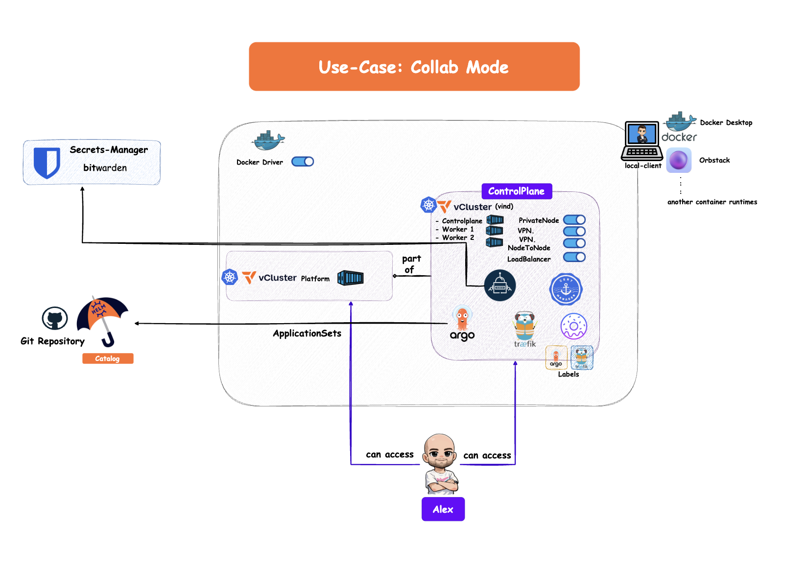
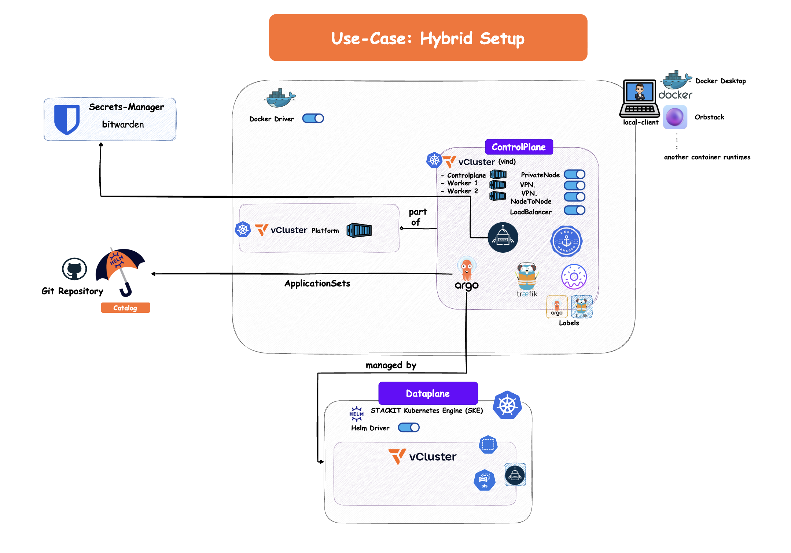
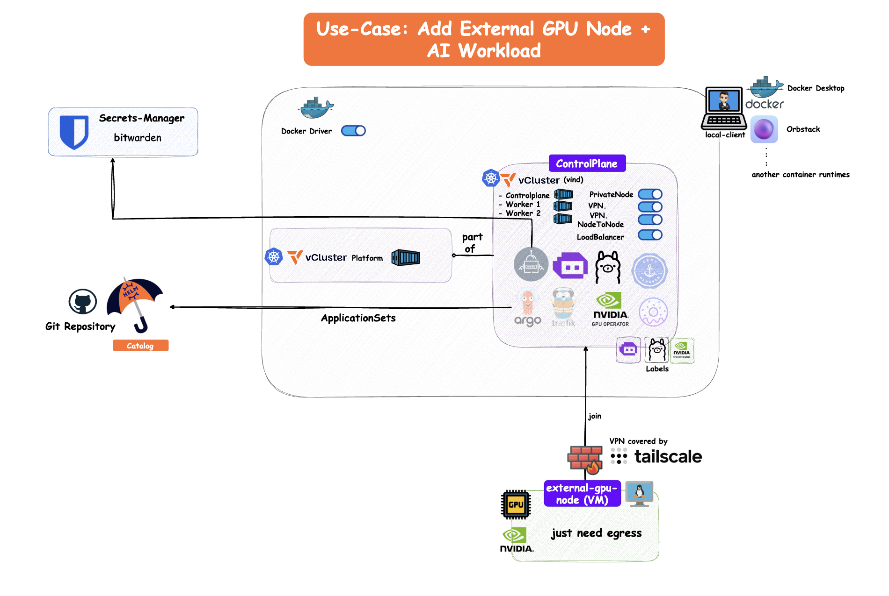
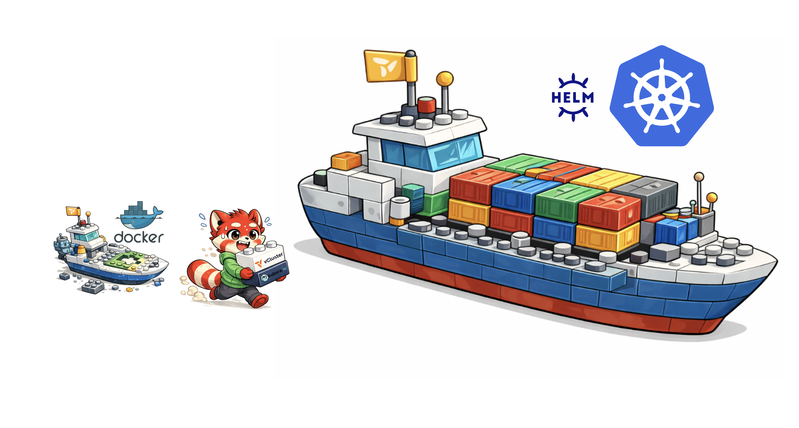

# Additional Use Cases

This part part of the documentation covers additional use cases for the setup we have created in this workshop.

## Collab Mode like "Code with me" for Kubernetes Clusters


### Access vCluster Platform or dedicated vCluster - 02-00 💻





## Test Bitwarden Secrets Manager Integration - Bitwarden 💻

### How to work with External Secrets and Bitwarden - 02-01 💻 (Skip)

Just create a simple secret in Bitwarden like:

* Name: `db-password`
* Value: `vind-is-awesome`

Then create a file under `customer-service-catalog/helm/controlplane/argo-cd/additional-values.yaml` with the following content:

```yaml
externalSecrets:
  secrets:
    db-password:
      secretStoreRef: controlplane-prod
      data:
        - secretKey: password
          remoteKey: db-password
```

Your secretStoreRef is your combination of project name and stage, or just look it up with:

```bash
kubectl get clustersecretstore
```

Commit and push the changes to your Git repository and wait until Argo CD syncs the change or refresh the application in the Argo CD UI.

Then check if the secret was created in the cluster:

```bash
kubectl get externalsecret -n argocd

NAME             STORETYPE            STORE               REFRESH INTERVAL   STATUS         READY
db-password-es   ClusterSecretStore   controlplane-prod   5m                 SecretSynced   True

kubectl get secret db-password -n argocd
NAME          TYPE     DATA   AGE
db-password   Opaque   1      11m
```

### How to add a new Cluster to the Hub - 02-02 💻👩‍🏫



You have a controlplane cluster running, which was designed to be the hub cluster. You can add any Kubernetes cluster or even another vCluster as a spoke cluster to it.

You just need to first create a secret for your kubeconfig in Bitwarden like:

* Name: `vcluster-2`
* Value: (content of your kubeconfig file)

Then create a file under `customer-service-catalog/helm/controlplane/argo-cd/additional-values.yaml` with the following content:

```yaml
bootstrapValues:
  cluster:
    - additionalLabels:
        external-secrets: "activated"
      name: vcluster-2
      project: controlplane-prod
      remoteRef:
        remoteKey: vcluster-2
        remoteKeyProperty: vcluster-2
      secretStoreRef:
        kind: ClusterSecretStore
        name: controlplane-prod
```

Based on the `additionalLabels`, you can deploy different applications from your catalog to 1, 10, 100 or 1000 clusters.

Commit and push the changes to your Git repository and wait until Argo CD syncs the change or refresh the application in the Argo CD UI.

Then check if the secret was created in the cluster:

```bash
kubectl get externalsecret -n argocd

NAME             STORETYPE            STORE               REFRESH INTERVAL   STATUS         READY
db-password-es   ClusterSecretStore   controlplane-prod   5m                 SecretSynced   True
vcluster-2-es    ClusterSecretStore   controlplane-prod   5m                 SecretSynced   True

kubectl describe secret -n argocd vcluster-2-cluster-secret

Name:         vcluster-2-cluster-secret
Namespace:    argocd
Labels:       argocd.argoproj.io/secret-type=cluster
              external-secrets=activated
Type:  Opaque
...
```

You should see a newly created application that deploys the external secret operator to vCluster-2, running in our case on a managed Kubernetes solution in the cloud:

```bash
kubectl get applications -n argocd

NAME                            SYNC STATUS   HEALTH STATUS
controlplane-argocd             Synced        Healthy
controlplane-cert-manager       Synced        Healthy
controlplane-external-secrets   Synced        Healthy
controlplane-traefik            Synced        Healthy
vcluster-2-external-secrets     Synced        Healthy
```


## Add External Node - Beyond local Kubernetes Platform 💻👩‍🏫


In this part we extend our local Kubernetes platform with an external node.
The node can run anywhere and only needs an outgoing connection to the control plane cluster.

### Add External Node to vCluster (vind) - 02-03 💻👩‍🏫



> ⚠️ This part requires a running VM with outgoing access to the controlplane cluster through the vCluster platform. You can create the VM with the provider of your choice using Terraform, Crossplane, Pulumi, ClickOps, etc. You should also be able to run custom scripts or init scripts like the command below to automatically connect the node to the vCluster platform.

Connecting a node is very easy. You only need to run a command against the connected vCluster (in this case it is called `controlplane`):

```bash
vcluster token create
````

This will give you a command like this:

```bash
curl -fsSLk "https://hr1lyor.loft.host/kubernetes/project/default/virtualcluster/controlplane/node/join?token=etwjda...." | sh -
```

Execute this command on your external VM and you will see that the node is added to your local vind cluster.

```bash
kubectl get nodes

NAME           STATUS   ROLES                  AGE   VERSION
controlplane   Ready    control-plane,master   5d    v1.35.0
gpu-worker-0   Ready    <none>                 42s   v1.35.0
worker-1       Ready    <none>                 5d    v1.35.0
worker-2       Ready    <none>                 5d    v1.35.0
```

Now you have not only connected an external node to your local cluster, but also integrated it through Tailscale behind the scenes into your service mesh without exposing the node to the public internet.

If you now deploy an application with `replicas: 3` distributed across the nodes, create a Service of type `LoadBalancer`, and test it with a simple `curl`, you will see that traffic also reaches pods running on the external node through the configured VPN connection.

With this, your local development cluster gains an additional node that can run heavier workloads.


### Add External GPU Node to vCluster (vind) - 02-04 💻👩‍🏫

In this use case we add not only a normal CPU node, but a GPU node to our local cluster.
The setup is similar to the previous example.

This setup works well but is still static, because you need to execute the join command manually on the nodes. This is usually not the preferred way when working with Kubernetes.

Especially when running GPU nodes, which can cost around **€2,000 per month**, you typically want a dynamic way to scale nodes up and down depending on workload demand.

This is possible by integrating **Karpenter** with vCluster.
Karpenter can work together with Terraform and vCluster, meaning you can use it anywhere a Terraform provider exists that can create VMs.

However, this part is **not part of today's workshop**, because it goes deeper into event-driven autoscaling and architecture topics.


### Deploy Custom LLM on the GPU Node - 02-05 💻👩‍🏫

Thanks to the platform based on the **kubara general distro**, we already have a catalog that can easily be extended.

Under `managed-service-catalog` you will see three addons already included:

* **Ollama (local LLM)** – to load custom models and run them on the GPU node (can also run on CPU)
* **NVIDIA GPU Operator** – installs the drivers and runtimes needed for GPU workloads
* **kagent** – allows you to declare custom agents via CRDs, deploy them with GitOps, and connect them to your LLM through the VPN connection created behind the scenes with Tailscale

If you want to follow this setup with GPU workloads, you only need to activate the services in your `config.yaml`:

```yaml
clusters:
  - name: controlplane
    stage: prod
    type: controlplane
    dnsName: controlplane-prod.172.18.255.254.traefik.me
    ingressClassName: traefik
    services:
      ...
      gpuOperator:
        status: activated
      ollama:
        status: activated
      kagent:
        status: activated
```

Then run the generate command to create the Helm umbrella charts and deploy them with Argo CD:

```bash
./kubara generate --helm
```

Commit and push the changes to your Git repository and Argo CD will create the applications automatically using the ApplicationSet.

It will take around **10 minutes** until everything is ready.
The GPU Operator installs the drivers and runtimes on the node, then Ollama is deployed, downloads the `gpt-oss-20b` model, and finally the agent connects to the LLM through the `modelConfigs`.





If your external node does not have a GPU, or you want to run everything locally, you need to override the `nodeSelector`, GPU flag, and resource settings in the managed and custom catalog entries.
This setup was not tested but should work if enough storage is available.


However, running a node with **GPU=1** also has limitations. GPUs behave differently than CPUs, and in this setup Ollama can block the whole GPU.

You could of course add more GPU nodes, but that would become expensive.

Fortunately, there is another option.

Saiyam will show in the next part of the workshop how GPUs differ from CPUs and how you can solve this problem.

But first: a short break, some fresh air, and a cup of coffee ☕


---

## Use-Cases for this Setup

This setup is not just limited to running for the workshop.
You can run it with vCluster with a similar configuration on managed Kubernetes with the Helm provider.
But you can also run it without vCluster.

The local setup can be used for:

* Personal Education and Learning

This setup covers topics like:

* DevOps
* Kubernetes
* GitOps and GitOps Topologies
* Helm and Helm Umbrella Charts
* Policies
* Networking if you want to switch the CNI (BLOG REF)
* Secrets Management

This setup is ideal for **stakeholders** like:

* DevOps Engineers
* Platform Engineers
* Developers
* Trainers
* Speakers
* Curious Engineers


### Use Cases

- Running workloads on edge devices like Raspberry Pis, IoT devices, or VMs
- Extending local Kubernetes platforms with external nodes from different locations
- Building hybrid setups with managed Kubernetes clusters and node autoscaling (e.g. with Karpenter)
  - This allows you to run specific workloads on on-premises infrastructure or edge locations without running a full Kubernetes cluster there, especially if you do not have Kubernetes experts on-site
- Moving from local development environments to production setups using the Helm driver for vCluster (platform engineering perspective)
- Creating a local environment that closely mirrors the development platform used in your company
  (For some reason developers really love running everything locally)
- Local development with **real pair coding**

We love — or at least I do — pair coding features in tools like IntelliJ or VS Code. Collaboration works great there. Outside of development we already collaborate in tools like HedgeDoc or Google Docs. Humans are built for collaboration.

Now we can have something similar for **Kubernetes environments**.
